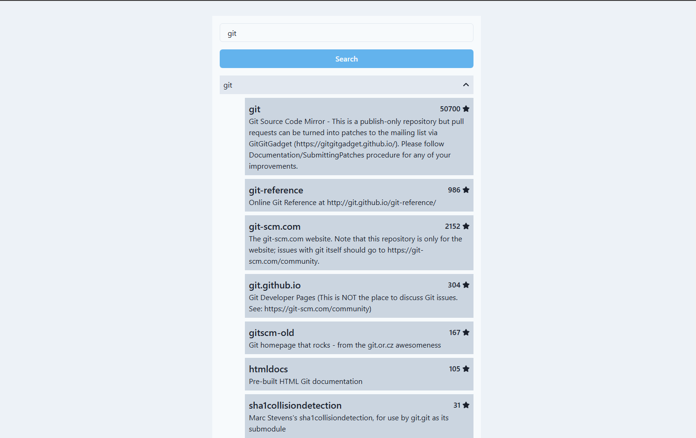

# Recruitment task

## Table of Contents

- [Description](#Description)
- [Installation](#installation)
- [Usage](#usage)
- [Features](#features)

## Description

The goal of the task was to implement GitHub API and allow users to search for up to 5 GitHub users.

## Installation

To install the app run

```
yarn install
```

To start the app run

```
yarn run dev
```

To run Storybook use

```
yarn run storybook
```

To run tests use

```
yarn test
```

## Usage

|                                                                                  |                                                               |
| :------------------------------------------------------------------------------: | :-----------------------------------------------------------: |
|                 _1. Home page_                   | _2. Loading users_  |
| _3. Expanded repositories_  |       _4. Data fetching error_        |
